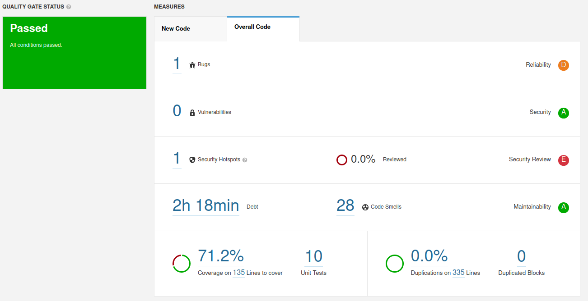

## SonarQube analysis

#### Quality Gate

The project passed on the defined quality gate, which means although the code might have some problems, it passed the conditions we define as necessary for a production ready software.

#### Issues

| Issue | Problem Description | How to Solve |
|---|---|---|
| Bug | Creation of a new Random() object each time we need a new random number | Create a singleton Random object then re-use it |
| Code Smell | Loop increment in loop body | Define loop increment on For definition |
| Code Smell | Return should is an ArrayList type | Use the List interface instead |
