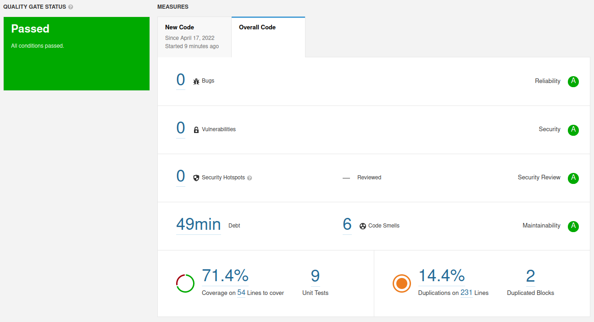

## SonarQube results

# a)
## Technical Debt

 The technical debt value indicates the ammount of effort that needs to be put to fix the code. In this case, 49 mins of bug and code smell fixing.

# b)

## pom.xml -> Remove commented out code

This is just a mysql dependency I used on previous lab

## Car // CarDTO -> Duplicated code [DEPRECATED]

Since we repeat getters and setters, a code smell is raised. SonarQube indicates in future versions this will no longer be an issue so no actions were taken to fix this.

## Car -> Remove empty statement

Remove the ";" on the empty constructor of Car class

# d)

There are 14 uncovered code lines.
6 on the Controller
2 on the Application
6 on the DTO

Also 2 conditions are not covered in the Controller, related to the HTTP codes when the Entities are found or not.