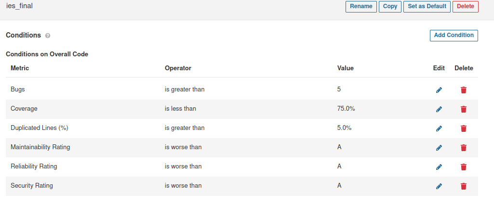
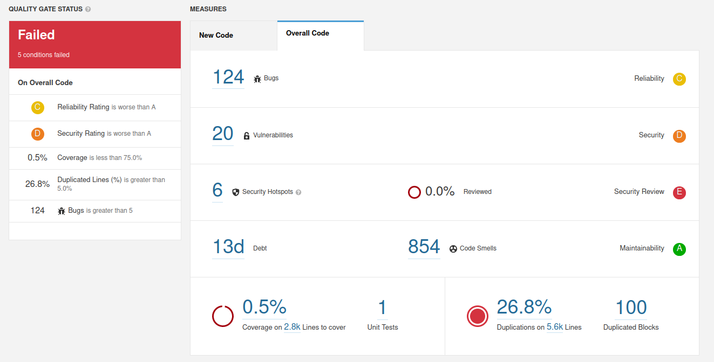

# IES_52 Project Repository

https://github.com/goncalo-leal/IES_Final_Project

# a)

A quality gate was created, we added coverage as a condition even though we dont have any tests...

And the results are:

Sendo a maior vulnerabilidade ter deixado o Serras fazer pushes.

# b)

We obviously don't have to """"try"""" to break it :)

Malta diz ah e tal o código tá um nojo, eu digo que tou a chillar com o meu 18

